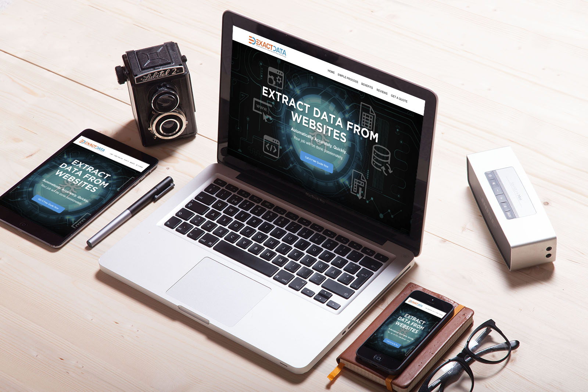

<section id="home" class="banner_section background_bg overlay_bg full_screen" data-img-src="assets/images/banner.jpg" style="background: url('assets/images/banner.jpg') center center / cover;">
    

        
<!-- STRART CONTAINER -->
            

                

                    

                        <h2 class="animation" data-animation="fadeInDown" data-animation-delay="1s">Harvest Data from Websites</h2>
                        <h5 style="color:#F36729;">Where Experiences Make a Big Difference.</h5>
                        
                        

                            <b>Scraping data from a website is not difficult.
                             
                            What makes it challenging is, <u>to get all pices of data with 100% accuracy, clean, and without being traced/blocked by its anti-scraping methods</u>.

                        </b>

                        

                        

                            <a class="btn btn-outline-white animation animated fadeInUp page-scroll" href="#about" data-animation="fadeInUp" data-animation-delay="1.8s" style="animation-delay: 1.8s; opacity: 1;">Learn More</a>
                        

                            

                    

                    
                

                

                

                    <h3 style="color:white;">Ready to discuss your project?</h3>
                    

                
 
            

        
<!-- END CONTAINER-->
        <!-- <a href="#about" class="down down_white page-scroll"></a> -->
    

    
</section>

<section id="about" class="overflow_hide">
    

        

            

                

                    
                

            

            

                
                <h2>About exactdata.io</h2>
                

                    <b>
                    At exactdata.io, with more than 8 years in the industry, we have all the skills, cloud-based platform to deliver exactly the data you need, from any website, at any scale. We're second to none in terms of quality, flexibility and fast turnaround.      
                    </b>
                

                
                <h4>Benefits of using our services</h4>
                

                    <ul>

                        <li><b class="text_default">High quality data</b>: accurate, clean, intuitively structured</li>
                        <li><b class="text_default">Fast turnaround</b>: we just need 1-3 days to complete a scrape of website with up to 50k records.</li>
                        <li><b class="text_default">Competitive price</b>: with great experices in the field, we manage to handle the job effectively, to save you money and time.</li>
                        <li><b class="text_default">Money back guarantee</b>: you'll be charged nothing if not fully satisfied with the results.</li>
                        
                    </ul>
                    
&nbsp;

                

            

        

        

            

                

                    

                        

                            <h2 class="">Try us now and enjoy the peace of mind!</h2>
                        

                        
    
                            <a href="#get-a-quote" class="btn btn-outline-white page-scroll">Get started</a>
                        

                    

                

            

        
   
    

</section>

<section id="workflow"  class="light_gray_bg">
    

        

            

                <h3>Workflow: designed to keep you relaxed.</h3>
            

        

        

            

                

                    
 
                        
                    

                    

                        <h5>Requirement Disucssion</h5>
                        
It's very important to clearly undertand what you need, at the first place, to avoid wasting your valuable time later. Thus, we'd like to review your requirements, discuss with you, one-on-one, to make everything clear.

                    

                

            

            

                

                    
 
                        
                    

                    

                        <h5>Job Processing</h5>
                        
Once agreement confirmed, including the cost and timeline, our experts will start building the scraper, let it crawl and extract the required data. <u>Not only we build the scraper skillfully, but also carefully do the quality check before sending you the final results</u>.

                    

                

            

            

                

                    
 
                        
                    

                    

                        <h5>Payment</h5>
                        
<b>No satisfaction, no payment</b>. Most of the time, our clients are satisfied with the first version of data. We'll send payment request once you're happy with what you have.

                    

                 

            

        

    

</section>

<section id="reviews">
    

        

            
&nbsp;

            

                

                    <h3>Our clients said on <a href="{{site.upwork_profile_url}}" target="_blank" class="text_default">upwork</a> marketplace</h3>
                

                

                    <ul class="recent_post list_none">
                        
                        <li>
                            <blockquote class="blockquote quote_style2">
                              <b><i>{{review.job}}</i></b>  
                              
{{review.comment}}

                              <footer class="blockquote-footer"><i>posted by</i> <b>{{review.client}}</b>, <i>from</i> <a target="_blank" href="{{site.upwork_profile_url}}">Upwork</a></footer>
                            </blockquote>
                             
                        </li>
                        
                        
                    </ul>

                

                

            
  
            
&nbsp;

        

        

            

                

                    

                        

                            <h2 class="">Let us get the data for you now.</h2>
                        

                        
    
                            <a href="#get-a-quote" class="btn btn-outline-white page-scroll">Get started</a>
                        

                    

                

            

        

            
    

        
</section>

